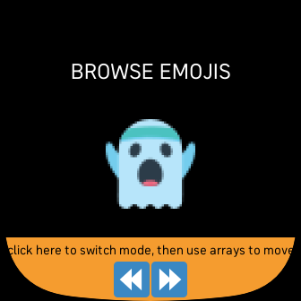

# emojiPicker

Little file to show the currently available emojis (from fitmoji.ttf) on fitbit-devices and their fitbit-specific appearance
* click on the orange field (NOT text) to switch between single/multi view
* from there you can browse forward/backward
* single shows index in hex array plus hexcode
* multi shows 30 emojis per page
* 169 BMP chars working
* if you click an emoji, it gets console.logged to the terminal so you could copy it into your text from there.

## single-view

## multi-view

